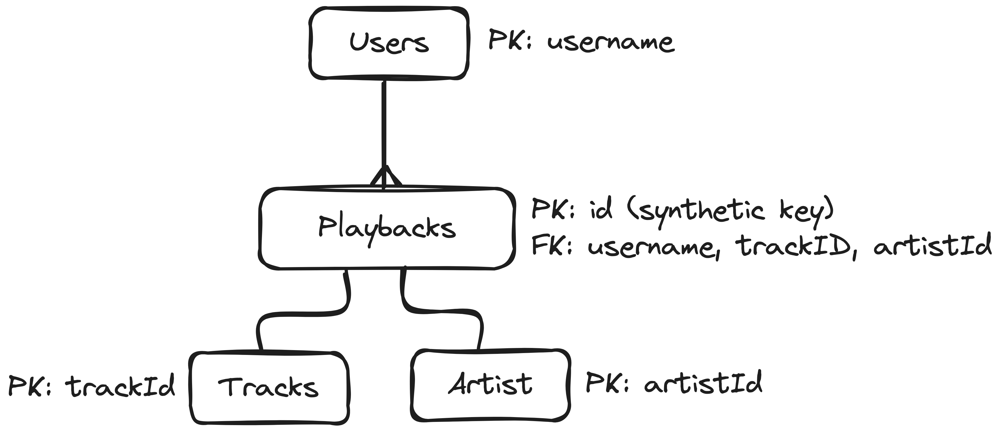

# Scratchpad for db diagrams
Table users{
    user_name string [primary key]
}

Table playback {
    id int [primary key]
    user_name string
    ts timestamp
    track_id string
    platform string
    ms_played bigint
    conn_country string
    ip_addr_decrypted string
    user_agent_decrypted string
    reason_start string
    reason_end string
    shuffle boolean
    skipped boolean
    offline boolean
    offline_timestamp bigint
    incognito_mode boolean
}

Table track {
    track_id string [primary key]
    track_name string
    artist_name string
    album_name string
    spotify_track_uri string
    episode_name string
    episode_show_name string
    spotify_episode_uri string
}

Ref: "users"."user_name" < "playbacks"."user_name"

Ref: "playbacks"."track_id" < "track"."track_id"

<!-- // TODO: Create this table later -->
<!-- // Table Artist {} -->

Ref: "Users"."username" < "Playbacks"."username"

Ref: "Playbacks"."ts" < "Tracks"."trackId"
---

